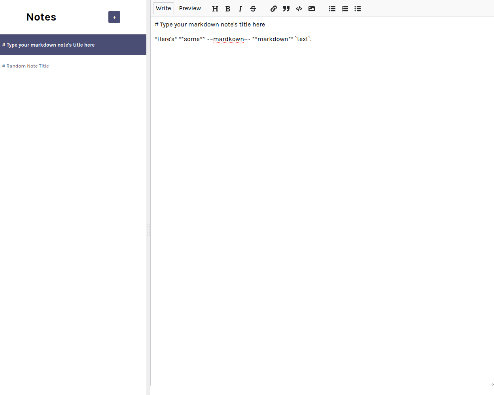
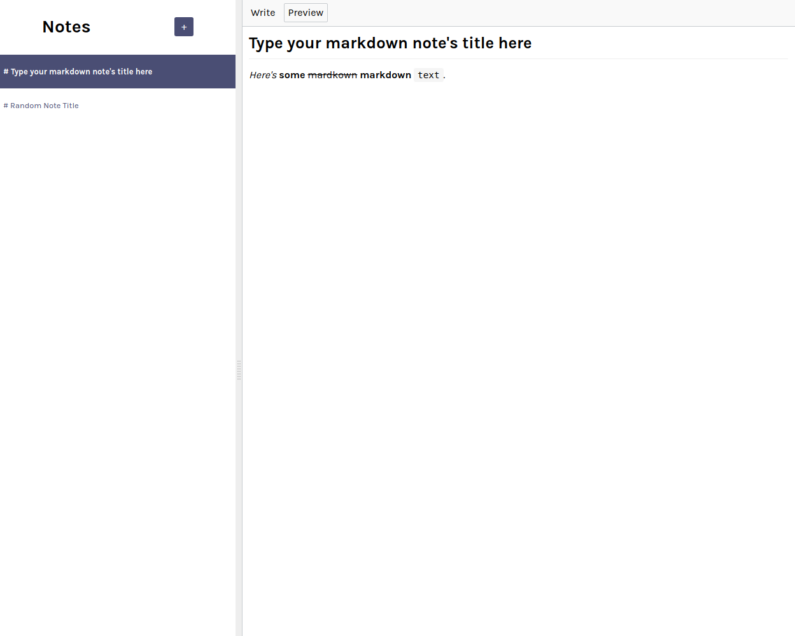

# Scrimba React Project #6: Notes App

The goal of this Scrimba project was to create a notes app using React and Firebase.

I started and finished this project in May 2023.

## Assignment

[Scrimba - Learn React - #6 Notes App](https://scrimba.com/learn/learnreact)

## Technology

- React
- JavaScript
- Vite
- CSS
- Firebase

## Key Concepts

- Firebase: setup, Firestore database, syncing notes data; adding, deleting and updating data
- State: useState, changing state, updating state
- useEffect: side effects, syntax, dependencies array, async functions
- setTimeout & clearTimeout methods

## Features

- Markdown
- Recently updated notes are moved to the top
- Debouncing updates: delaying the Firebase request for a specified amount of time

## Links

[Live Demo](https://brightneon7631.github.io/scrimba-notes-app/)

[My Other Projects](https://brightneon7631.github.io/odin-scrimba-projects/)

## Screenshots

### Desktop





## Sources

- https://fonts.google.com/specimen/Karla

## Deployment

```bash
# clone repo
git clone

# install project dependencies
npm install

# run vite dev server
npm run dev

# create a production build
npm run build
```